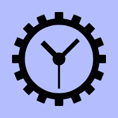

<div align="center">
    <a href="https://rustytime.shymike.dev">
        
    </a>
</div>
<div id="user-content-toc" align="center">
  <ul align="center" style="list-style: none;">
    <summary >
      <h1><a href="https://rustytime.shymike.dev">rustytime</a></h1>
    </summary>
  </ul>
</div>
<p align="center">🕒 blazingly fast time tracking for developers</p>

<div align="center">
    <a href="https://crates.io/crates/rustytime-server"></a>
    <a href="https://github.com/ImShyMike/rustytime/actions/workflows/ci.yml"></a>
    <a href="https://crates.io/crates/rustytime-server"></a>
    <a href="https://crates.io/crates/rustytime-server"></a>
    <a href="https://crates.io/crates/rustytime-server"></a>
    <a href="https://crates.io/crates/rustytime-server"></a>
</div>

---

## Features

- ✅ Time tracking
- ✅ Stat visualization
- ✅ WakaTime compatible
- ✅ Fast and memory efficient

## What is this?

`rustytime` is a [WakaTime](https://wakatime.com) compatible server that can be used to track time in most apps with any of the existing [plugins](https://wakatime.com/plugins)!

## Installation

### Compiling from source

Dependencies:

- rust
- docker
- git

```bash
git clone https://github.com/ImShyMike/rustytime.git
cd rustytime
mv .env.example .env
# Edit the .env file before running docker compose
docker compose up
```

### Pulling containers from dockerhub

Dependencies:

- docker
- curl

```bash
mkdir rustytime
cd rustytime
curl -O https://raw.githubusercontent.com/ImShyMike/rustytime/main/.env.example
curl -o docker-compose.yml https://raw.githubusercontent.com/ImShyMike/rustytime/main/docker-compose.yml
mv .env.example .env
# Edit the .env file before running docker compose
docker compose up
```

## Local Development

```sh
# Clone the repo
$ git clone https://github.com/ImShyMike/rustytime && cd rustytime

# Copy the env file
$ cp .env.example .env
```

Edit your `.env` file to include the following:

```env
# GitHub OAuth Settings
GITHUB_CLIENT_ID=client_id_goes_here
GITHUB_CLIENT_SECRET=client_secret_goes_here
```

### Build & Run

```sh
# Run the full app
$ docker compose up

# OR

# Run the databse + backend 
$ docker compose up timescaledb rustytime
# Run the frontend
$ cd frontend && bun run dev
```

The app should now be available at [http://localhost:5173](http://localhost:5173)

### Seeding the DB

The `seed` feature can be enabled in the build to seed the database with a single user and 10000 heartbeats.

```bash
cargo run --features seed
```

## WakaTime

When using a WakaTime client, point your requests to `http://localhost:3000/api/v1` (or `https://api-rustytime.shymike.dev/api/v1` if using the deployed version)

## License

This project is licensed under the [GNU AGPLv3](https://github.com/ImShyMike/rustytime/blob/HEAD/LICENSE)
